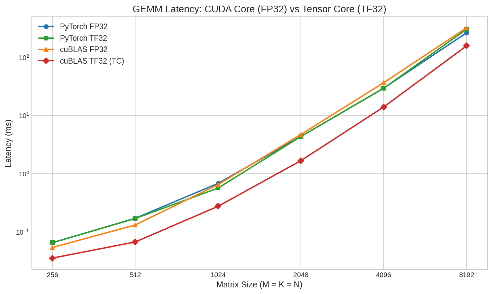
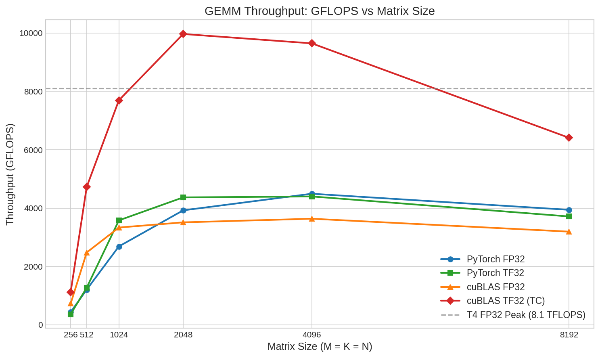
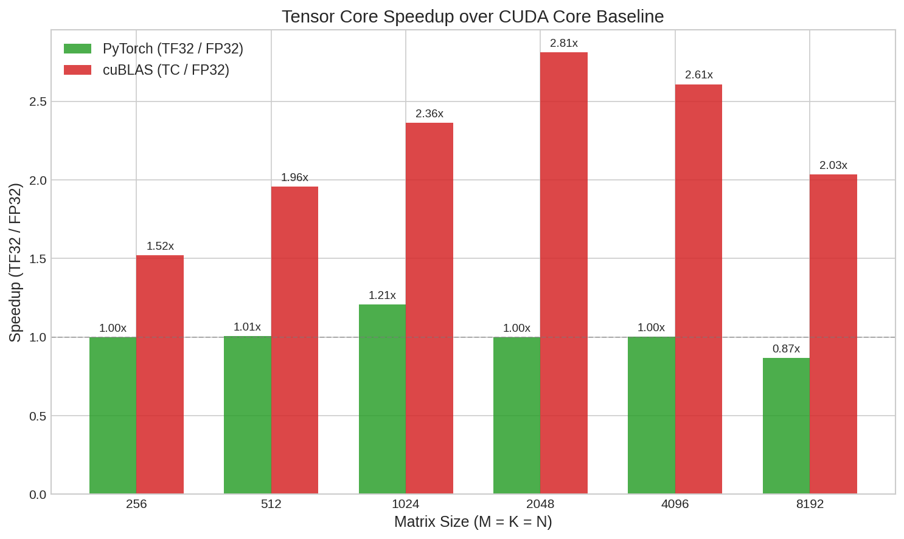
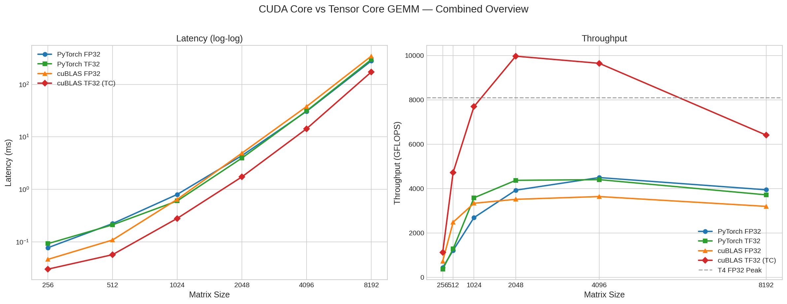

# CMPE 258 — Homework 1 Excellent: CUDA Core vs Tensor Core GEMM Benchmark

Measures and explains the performance difference between a **traditional CUDA-core FP32 GEMM** path and a **Tensor Core** GEMM path using a simple fully connected layer.

## Run in Google Colab

> **Requirements:** Select **GPU runtime** (Runtime → Change runtime type → T4 GPU) before running.

## What's Inside

The notebook (`gemm_benchmark.ipynb`) benchmarks GEMM (General Matrix Multiply) across two frameworks and two precision modes:

| Framework | FP32 Baseline (CUDA Cores) | Tensor Core Path |
|-----------|---------------------------|-----------------|
| **PyTorch** | `nn.Linear` with `allow_tf32=False` | `nn.Linear` with `allow_tf32=True` |
| **cuBLAS (CUDA C++)** | `cublasSgemm` | `cublasGemmEx` with `CUBLAS_COMPUTE_32F_FAST_16F` |

### Benchmark Details

- **Matrix sizes:** 256, 512, 1024, 2048, 4096, 8192 (square M=K=N)
- **Warmup:** 50 iterations
- **Timed:** 200 iterations per configuration
- **Timing:** GPU-side events (`torch.cuda.Event` / `cudaEventElapsedTime`)
- **Target GPU:** NVIDIA T4 (Turing, sm_75)

### Important Note on T4 and TF32

The T4 (Turing) has Tensor Cores but **does not support TF32** — that is an Ampere (sm_80+) feature. On T4:
- PyTorch's `allow_tf32` flag has **no effect** — both modes produce identical results
- The cuBLAS benchmark uses `CUBLAS_COMPUTE_32F_FAST_16F`, which leverages T4's **FP16 Tensor Cores** (FP32 inputs → FP16 multiply → FP32 accumulate)

This means the real Tensor Core speedup is visible only in the cuBLAS results.

## Results

### Latency Comparison

### GFLOPS Throughput

### Speedup (Tensor Core / FP32)

### Combined Overview

## How to Run

1. Click the **Open in Colab** badge above
2. Set runtime to **T4 GPU**
3. Run all cells (Runtime → Run all)
4. Results and plots are generated inline and saved to `outputs/gemm_benchmark/`
5. Optionally, use the "Push notebook + plots to GitHub" cell to commit the executed notebook and plots directly from Colab
